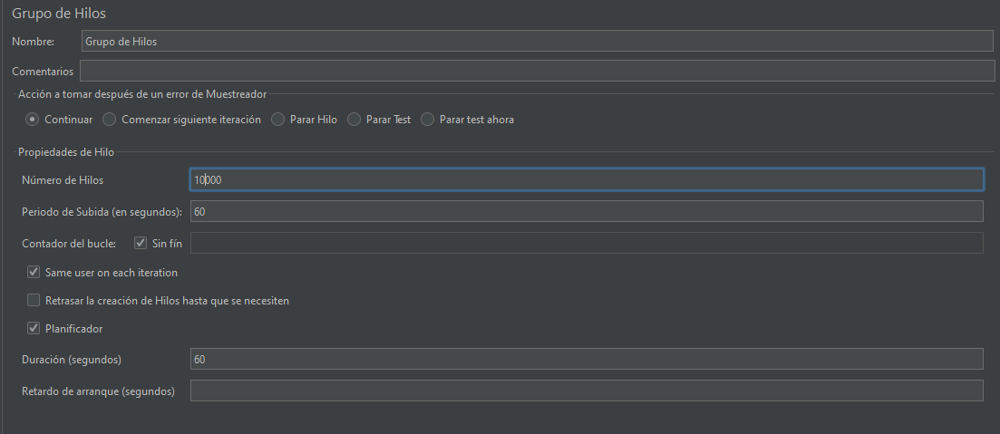
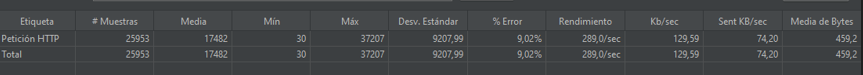
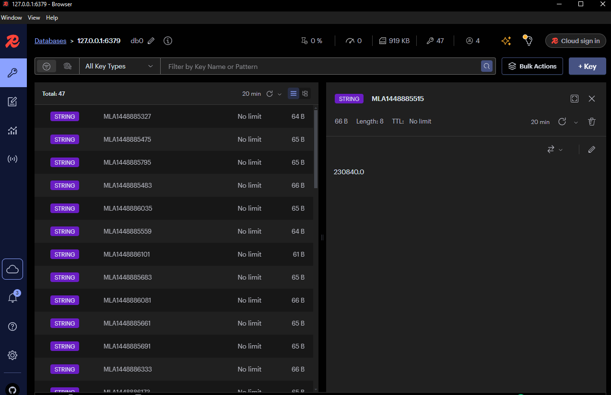
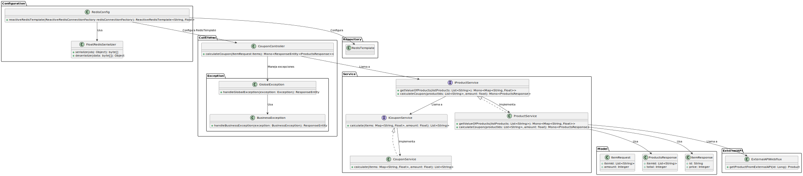

# Ejercicio entrevista: Cupón

Esta aplicación está construida con **Spring Boot** y permite la generacion de cupones como ejercicio para el cargo de Ingeniero Senior, utilizando **Java 17** y **Docker** para facilitar el despliegue y la ejecución.

## Descripción

La aplicación proporciona funcionalidades para crear, gestionar y aplicar cupones en un entorno de comercio electrónico. Usando **Spring Boot**, este proyecto facilita la integración de cupones en sistemas backend. Además, está optimizado para ejecutarse en contenedores **Docker**, lo que permite un despliegue rápido y sencillo.

### Características

- Generacion de cupón para clientes de acuerdo al monto.
- Peticiones **asincronas** para obtener los precios de los productos.
- Manejo de **caché** con redis.
- Integración fácil con aplicaciones frontend a través de una API **RESTful**.
- Despliegue sencillo en contenedores **Docker**.
- **Java 17** y **Spring Boot** como principales tecnologías.

## Tecnologías Utilizadas

- **Java 17**: Lenguaje de programación principal.
- **Spring Boot**: Framework para el desarrollo de aplicaciones backend.
- **Docker**: Contenerización de la aplicación para facilitar su despliegue.
- **Gradle**: Sistema de construcción y gestión de dependencias.
- **Redis**: Manejo de caché.

## Requisitos

Antes de comenzar, asegúrate de tener instaladas las siguientes herramientas:

- **Java 17**: [Descargar Java 17](https://adoptopenjdk.net/)
- **Docker**: [Descargar Docker](https://www.docker.com/get-started)
- **Docker-compose**: [Descargar Docker compose](https://docs.docker.com/compose/install/)
- **Postman**: [Descargar Postman](https://www.postman.com/downloads/)

## Instalación

Sigue estos pasos para configurar el proyecto en tu entorno local.


## Instalación
### 1. Clonar el repositorio

```bash
git clone https://github.com/JonatHub/coupons.git
cd coupons
```


### 2. Ejecutar el docker compose

```bash
docker-compose up --build
```

La aplicación ahora estará disponible en http://localhost:8080
 y redis en `http://localhost:6379`.

Tambien se habilita el puerto http://localhost:5540 para visualizar la caché de redis.


## Uso de la API

### Endpoints disponibles


- `GET /coupon/{id}`: Obtiene un cupón específico por su ID.


### Ejemplo de creación de cupón (POST)


**Request**:


```json
{
	"item_ids":  [
	"MLA1448885331",
	"MLA1448885327"
	],
	"amount":  13000
}
```

**Response**:

```json
{
	"item_ids":  [
	"MLA1448885331"
	],
	"total":  12690
}
```

## Pruebas de carga

Para poder testear los 100k rpm esperados se utilizó **Jmeter** en un computador local con las siguientes especificaciones:

Intel(R) Core(TM) i7-3537U CPU @ 2.00GHz   2.50 GHz
RAM 8,00 GB

En la configuración de Jmeter se utilizaron 10000 hilos con un periodo de subida de 60 segundos



Los resultados fueron satisfactorios con un % de error de solo el 9,02% y un rendimiento de 289 peticiones/seg



Adicionalmente se muestra visualmente usando **Redis insight** como guarda en caché los productos http://localhost:5540




## Arquitectura del Proyecto

El proyecto está diseñado siguiendo una arquitectura modular y organizada en varios paquetes principales:

- **Controller**: Contiene la lógica para manejar las solicitudes HTTP, incluyendo excepciones globales y personalizadas (`GlobalException`, `BusinessException`).
- **Service**: Define la lógica de negocio principal, separada en interfaces (`IProductService`, `ICouponService`) y sus implementaciones (`ProductService`, `CouponService`).
- **Model**: Modelos de datos que representan las entradas y salidas de la API, como `ItemRequest`, `ItemResponse`, y `ProductsResponse`.
- **Repository**: Gestiona la interacción con Redis a través de `RedisTemplate`.
- **Configuration**: Configuración de Redis y serialización personalizada mediante `RedisConfig` y `FloatRedisSerializer`.
- **ExternalAPI**: Comunicación con APIs externas para obtener información adicional, manejada por `ExternalAPIWebflux`.

El diagrama PlantUML muestra las relaciones entre los paquetes y clases, destacando cómo cada componente interactúa de manera cohesiva dentro del sistema.

